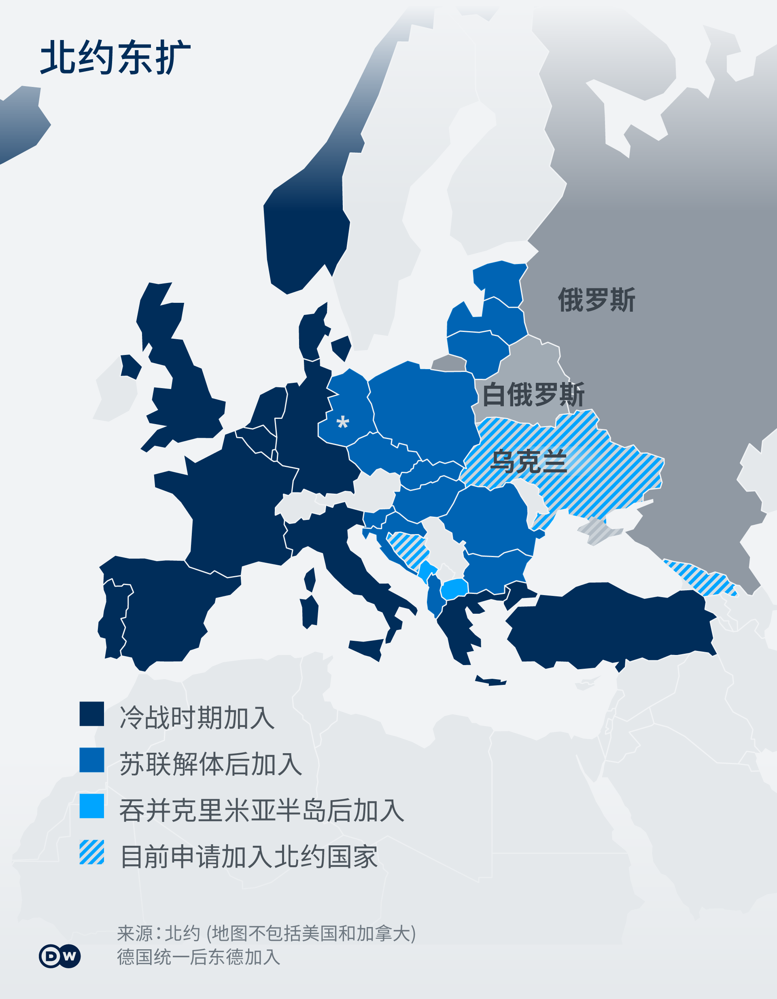
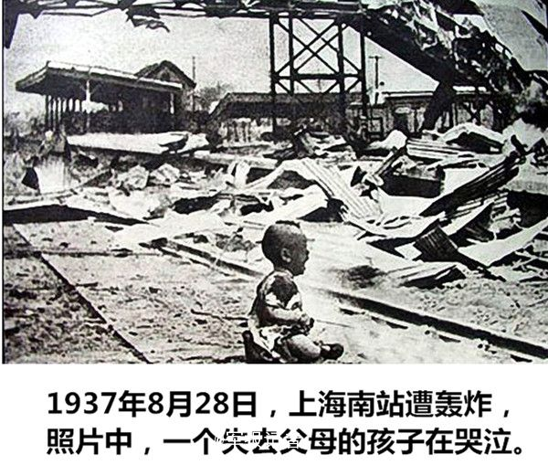

正当徐州铁链女第五份公告让人惊掉下巴时，本来应是一场全民质疑和求真相的时候，但普京突然全面入侵了乌克兰，人们的注意力一下被转移。这样一来，徐州这边的真相可能变得遥遥无期。

我们暂时先说乌克兰的事情，这个徐州性奴问题俺后面一定补上。

乌克兰事情过程大致是这样的，乌克兰东南有个克里米亚半岛，这个地方可出名了，当年土耳其和沙俄争得死去活来，英国人也在这折戟沉杀。最后沙俄夺取了，苏联继承了，后赫鲁晓夫为了庆祝俄乌合并三百周年给了乌克兰，苏联解体后自然也是乌克兰的。但2014年乌克兰亲俄政府失势，普京说赫鲁晓夫说的不算了，强行夺了回来（以公投形式，像不像苏联对外蒙的做法？）。乌克兰自然打也打不过，只好忍气吞声，同年东部两个州想暴力脱欧入俄，最后乌俄两国签订《明斯克协议》，让这两州自治。但是中欧各国都慌了，万一俄罗斯对他们也这样干就惨了，于是纷纷申请加入北约军事组织，也就是拜码头，靠大哥。苦主乌克兰当然也申请了，但国内也有亲俄派，不是很顺利。最近好像有点眉目了，普京表示不同意。最后就是现在这样，先宣称承认东部两个自治州独立，后干脆直接全面入侵乌克兰，大有整个乌克兰都是我的之势。

对于乌克兰，国内的报道重点描述乌克兰时怎样怎样不知好歹，非想加入北约，伤害了俄罗斯人民的感情，人家一向爱好和平、大国担当的俄罗斯帝国迫不得已，
要去乌克兰维护和平了。当然啦，为了和平不可避免的造成了，大规模的平民伤亡和基础设施的破坏，这些在爱好和平的人看来是必要的损失。

呵。。。法西斯估计也没有过这样厚颜无耻。最近（2月25号）的消息是，俄罗斯国内50多个城市的民众自发组织反战集会，普京下令镇压，已经逮捕了数千人。另一条消息是，塔利班（一直被联合国认为是恐怖组织）呼吁俄乌双发停止战争，以和平谈判的方式解决分歧。这点被打的乌克兰开战初自然是求之不得的，但普京好像不喜欢别人这样劝他，不然也不会逮捕这么多反战的俄罗斯民众。

让人愤怒的是美国和欧洲各国的隔岸观火，不可否认欧美国家存在很多道貌岸然的伪君子，当然这是人的问题，自由民主的制度是（几乎）所有正义人向往的，但只能解决国内的问题。对国际间的不义之事，因为也捞不到什么选票，政客们自然不上心。正义感缺失的领导人统治国家，在民主社会就是这样偏向孤立主义，自己过好就行不管他人死活；如果这种人做了专制国家的领导，自然是走向对内独裁对外侵略扩张的法西斯道路，普京就是这类代表。

自美国自成立以来，本土从没有受过攻击，又其文化深层来自英国，所以孤立主义盛行。
1937年，日军全面侵华，美国作壁上观，还估计也就一年中国便沦陷。
蒋介石那段时间苦苦哀求，西方世界无人援手。直到日军轰炸南京后的哭泣的小孩张照片流传到美国，美国人的正义感终于被唤醒，开始大规模援助我们了。之后便是我们知道的事了。

